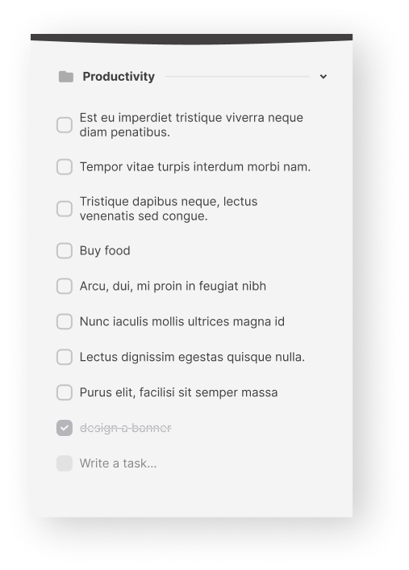
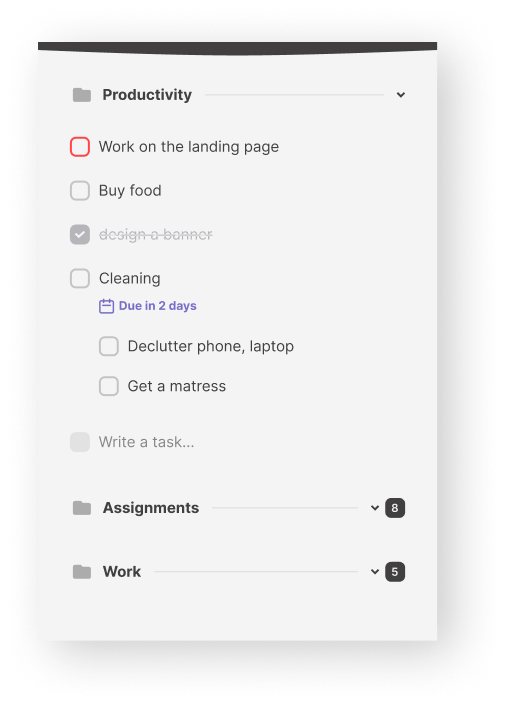

## Getting Started

First, run the development server:

```bash
npm run dev
# or
yarn dev
# or
pnpm dev
# or
bun dev
```

## Figma Design
[Figma Design](https://www.figma.com/design/Vz35216vYcrmpyv9IWIubr/To-Do-List-Design-(Community)?node-id=1-166&t=5UiEs75gWoJV4DSE-0)


<div>
  
  
</div>

